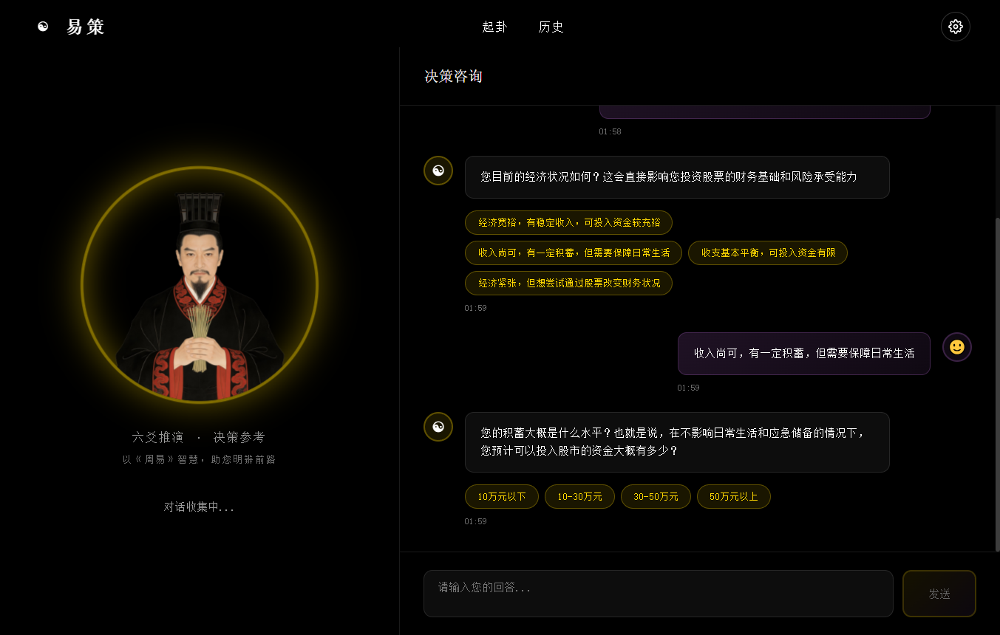
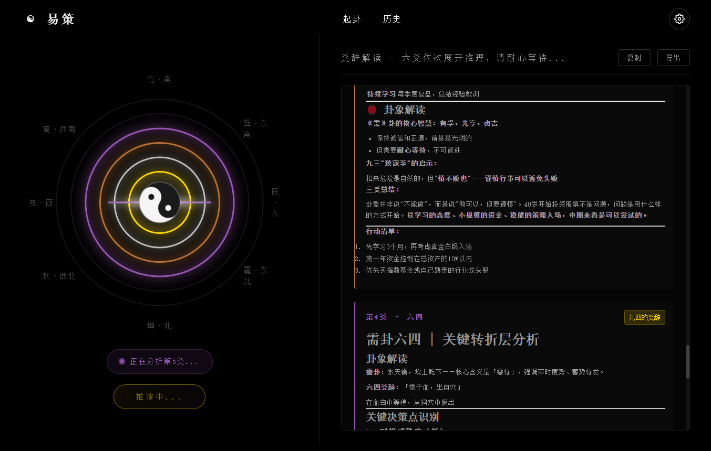
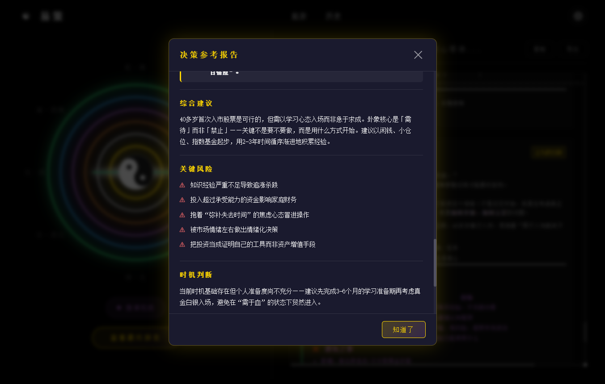

# 易策 (yice) - 基于周易64卦的AI多Agent决策系统

[](https://opensource.org/licenses/MIT)
[](https://www.python.org/downloads/)
[](https://github.com/RobbyShao-8ag/yice)

> "易者，变易也。策者，决策也。"

[English](README-en.md) | 中文

## ⚡ 一句话说明白

**不是算命，是用周易哲学框架做结构化决策分析的AI系统。**

市面上99%的"AI周易"只是套了个卦象外壳，答案全靠LLM自由发挥。

**易策**的不同在于：用周易的**符号体系 + 变化逻辑**驱动一个多Agent协同一推演体系——

每个"爻"都是独立视角的AI Agent，六个视角同时审视同一个问题，最后综合出有结构、有深度、有变化思维的决策参考。

---

## 🔬 核心技术差异化

| 普通AI算命 | 易策 |
|-----------|------|
| 一次LLM调用，返回一段文字 | **6个Agent并行推演**，各有专精视角 |
| 过程黑盒，不知道怎么得出结论 | **全透明**，每个爻的分析过程用户都看得到 |
| 卦象只是装饰，答案跟摇签没区别 | **卦象是真正的输入**，决定场景路由和权重 |
| 固定话术，答案同质化 | **多模型支持**，可配置不同LLM给不同Agent |
| 只告诉"好不好" | 告诉你**时机、环境、风险、策略、长期、极端**六层 |

---

## 📐 系统架构：六爻并行 + 变卦推演

```
用户问题 → 起卦官 → 场景匹配(64卦)
                     ↓
        六爻Agents（同时并行分析）
        初爻│二爻│三爻│四爻│五爻│上爻
         ↓  ↓  ↓  ↓  ↓  ↓
        风险│资源│时机│执行│规划│复盘
                     ↓
              变卦引擎（触发条件时）
                     ↓
            📄 决策参考报告
```

**灵感来源**：西周"三公议事"制度 + 现代多Agent协同架构（参考CrewAI/AutoGen），但核心决策逻辑完全重建于周易的"时、位、变"哲学。

---

## 📖 学术支撑

- **IEEE ICDEA论文** — 易经占卜进化算法（将周易符号系统形式化）
- **64卦二进制编码** — 乾☰兑☱离☲震☳巽☴坎☵艮☶，每卦对应一种典型决策情境
- **六爻体系** — 初爻感知→二爻资源→三爻风控→四爻执行→五爻规划→上爻复盘，形成完整决策链条

---

## 系统架构：五阶段Agent协同推演

```
用户问题
    ↓
起卦官 (QiguaAgent) - 多轮对话澄清问题
    ↓
场景路由器 (SceneRouter) - 匹配64种典型情境
    ↓
六爻Agents (6个并行) - 不同角度分析
    ↓
决策报告官 (ReporterAgent) - 综合生成参考报告
    ↓
决策参考报告
```

### 六爻Agent的角色分工

| 爻位 | 名称 | 现代映射 | 分析重点 |
|------|------|----------|----------|
| 初爻 | 环境感知层 | 现状评估 | 当前环境条件 |
| 二爻 | 资源配置层 | 资源盘点 | 可用资源分析 |
| 三爻 | 风险评估层 | 风险识别 | 潜在风险点 |
| 四爻 | 策略执行层 | 行动计划 | 具体执行方案 |
| 五爻 | 长期规划层 | 战略方向 | 长远影响评估 |
| 上爻 | 结果复盘层 | 终局反思 | 极端情况预警 |

---

## 快速开始：5分钟本地运行

### 1. 一键安装

```bash
# 克隆项目
git clone https://github.com/RobbyShao-8ag/yice.git
cd yice

# 一键安装脚本（自动检测Python版本、安装依赖）
./setup.sh
```

### 2. 配置API密钥

```bash
# 编辑 models.json，填入你的LLM API密钥
```

---

## 🎯 模型选择建议：为什么推荐国产大模型

周易推演需要深度理解：
- **文言文爻辞**：古汉语语法、典故引用
- **文化语境**："时、位、变"等周易哲学概念
- **历史背景**：西周制度、六十四卦演化逻辑

国产大模型中文训练数据占比更高，对这些内容理解更深，推演结果更准确。

### 三款推荐配置

| 模型 | 特点 | 价格 |
|------|------|------|
|  **DeepSeek R1** | 推理能力最强，性价比最高 | ¥1/百万tokens |
|  **Qwen3-Max** | 中文理解最好，支持1M超长上下文 | ¥2/百万tokens |
|  **GLM-5.1** | 新用户福利：送2000万免费tokens | ¥5/百万tokens |

### 配置示例

**方案1：DeepSeek R1（推荐）**
```json
{
  "providers": {
    "openrouter": {
      "api_key": "your-key",
      "base_url": "https://openrouter.ai/api/v1"
    }
  },
  "agents": {
    "qigua_agent": { "provider": "openrouter", "model": "deepseek/deepseek-r1" },
    "scene_router": { "provider": "openrouter", "model": "deepseek/deepseek-r1" },
    "yao_agent": { "provider": "openrouter", "model": "deepseek/deepseek-r1" },
    "reporter": { "provider": "openrouter", "model": "deepseek/deepseek-r1" }
  }
}
```

**方案2：Qwen3-Max（阿里百炼）**
```json
{
  "providers": {
    "qwen": {
      "api_key": "your-key",
      "base_url": "https://dashscope.aliyuncs.com/compatible-mode/v1"
    }
  },
  "agents": {
    "qigua_agent": { "provider": "qwen", "model": "qwen3-max" },
    "scene_router": { "provider": "qwen", "model": "qwen3-max" },
    "yao_agent": { "provider": "qwen", "model": "qwen3-max" },
    "reporter": { "provider": "qwen", "model": "qwen3-max" }
  }
}
```

**方案3：GLM-5.1（智谱AI）**
```json
{
  "providers": {
    "glm": {
      "api_key": "your-key",
      "base_url": "https://open.bigmodel.cn/api/paas/v4"
    }
  },
  "agents": {
    "qigua_agent": { "provider": "glm", "model": "glm-5.1" },
    "scene_router": { "provider": "glm", "model": "glm-5.1" },
    "yao_agent": { "provider": "glm", "model": "glm-5.1" },
    "reporter": { "provider": "glm", "model": "glm-5.1" }
  }
}
```

**获取 API Key：**
- DeepSeek: https://platform.deepseek.com 或 https://openrouter.ai
- Qwen: https://dashscope.aliyun.com
- GLM: https://open.bigmodel.cn（新用户注册送2000万tokens）

---

### 3. 运行

```bash
# CLI版本（零依赖，快速体验）
python main.py

# Web版本（完整体验）
python web/main.py
```

---

<details>
<summary>📖 详细安装步骤（手动安装）</summary>

### 环境要求
- Python 3.11+
- Node.js 18+（Web版本需要）

### CLI版本（零依赖）
```bash
git clone https://github.com/RobbyShao-8ag/yice.git
cd yice
cp models.example.json models.json
# 编辑 models.json 配置 API 密钥
python main.py
```

### Web版本
```bash
# 后端
cd web/backend
python -m venv venv
source venv/bin/activate  # Linux/Mac
pip install -r requirements.txt

# 前端
cd ../frontend
npm install

# 启动
cd ../..
python web/main.py
```

</details>

---

## 界面预览：Web版本演示

### 1. 起卦阶段 - 多轮对话澄清问题


### 2. 推演过程 - 六爻并行分析


### 3. 决策报告 - 综合参考建议


---

## 数据优化与程序改进

### 数据文件说明
项目使用JSON文件存储64卦数据，结构清晰：

```
data/
├── hexagrams.json      # 64卦基本信息
├── lines.json          # 384爻爻辞
├── scene_mapping.json  # 场景到卦象的映射
└── yao_attributes.json # 爻位属性定义
```

### 如何优化数据
1. **丰富场景映射**：在`scene_mapping.json`中添加更多问题类型到卦象的映射
2. **完善爻辞解读**：在`lines.json`中为每个爻位添加更贴近现代的解读
3. **增加变卦逻辑**：实现`bian_gua.py`中的变卦引擎

### 如何改进程序
1. **Agent个性化**：每个Agent可以配置不同的LLM模型和人格
2. **并行优化**：将六爻分析从串行改为真正的并行执行
3. **交互增强**：增加用户反馈机制，让系统学习用户的决策偏好

---

## 项目初衷：一个40岁程序员的思考

我写这个项目，不是因为想搞什么AI算命，而是经历了人生起伏后，对两个问题的思考：

**第一，技术到底应该服务于什么？**

在互联网行业摸爬滚打20年，见过太多技术被用来做营销、做流量、做变现。但老祖宗留下的周易智慧，几千年来指导着中国人的决策，这种智慧难道不应该用现代技术让它更好地服务普通人吗？

**第二，AI到底缺什么？**

现在的AI很聪明，但缺少"时机感"。它知道该做什么，但不知道什么时候做最合适。周易的"时与位"思想，正是AI最需要补上的一课。

所以有了**易策**——不是要替代人的思考，而是提供一个参考框架，让AI的理性分析加上周易的时机智慧，帮助大家在重要决策时多一个思考角度。

---

## 开发路线图：未来功能规划

当前项目是 MVP 版本，以下功能正在开发中：

### 🔧 核心功能待完善

| 功能 | 状态 | 说明 |
|------|------|------|
| **变卦引擎** | ⏳ 待实现 | 基于朱熹《易学启蒙》的7种变爻规则 |
| **爻辞完善** | ⏳ 部分完成 | 384爻爻辞中部分为"待补充"状态 |
| **互卦分析** | ⏳ 待实现 | 二三四爻、三四五爻的互卦推演 |

### 🚀 高级功能规划

| 功能 | 状态 | 说明 |
|------|------|------|
| **用户反馈学习** | ⏳ 待开发 | 根据用户决策结果优化模型 |
| **历史记录** | ⏳ Web版有 | CLI版历史记录功能待完善 |
| **导出功能** | ⏳ 待实现 | PDF、Markdown格式报告导出 |

### 📊 数据优化方向

| 优化点 | 状态 | 说明 |
|--------|------|------|
| **场景映射扩展** | ⏳ 基础版 | 目前约80个场景，计划扩展到200+ |
| **爻位属性细化** | ⏳ 基础版 | 六爻角色分工可进一步细化 |
| **变爻规则完善** | ⏳ 待实现 | 7种变爻规则的完整实现 |

---

## 技术特色

- **零运行时依赖**：CLI版本只用Python标准库
- **多LLM支持**：每个Agent可独立配置不同模型，发挥其专长
- **透明推理**：用户能看到完整的分析过程
- **学术基础**：基于IEEE顶级期刊的易经进化算法
- **开源精神**：MIT许可证，欢迎贡献

---

## 贡献与交流

如果你也对传统文化+AI感兴趣，欢迎：
- 提交Issue讨论算法改进
- 提交PR完善代码或文档
- 在Discussions分享使用心得

**记住：我们不是在做算命，而是在探索AI决策的新可能。**

---

*"四十不惑，五十知天命。希望这个项目能帮助更多人，在人生的十字路口，做出更明智的选择。"*

—— 一个经历过风雨的老程序员