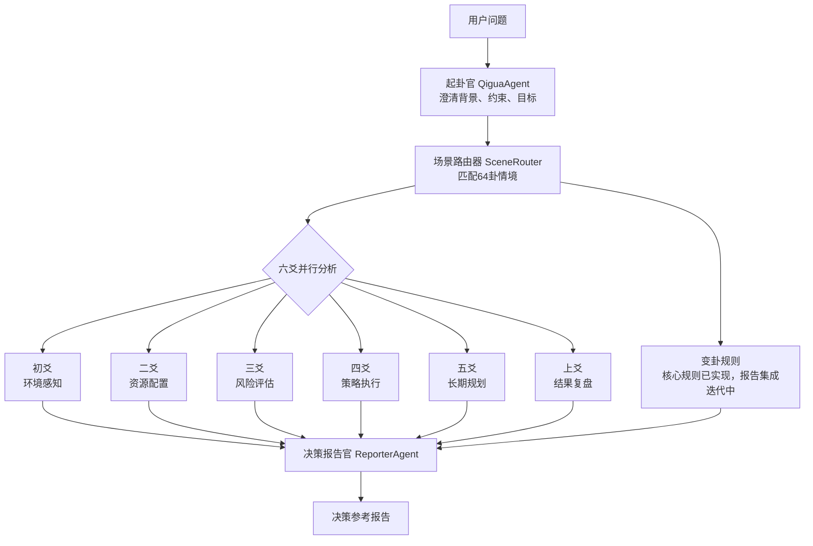

# 易策 (yice) - 零依赖的 AI 多 Agent 决策参考系统

[](https://opensource.org/licenses/MIT)
[](https://www.python.org/downloads/)
[](https://github.com/RobbyShao-8ag/yice)

[GitHub](https://github.com/RobbyShao-8ag/yice) | [Gitee 镜像](https://gitee.com/RobbyShaw8ag/yice) | [English](README-en.md) | 中文

> 易策不是算命工具，而是把周易的“时、位、变”抽象成一套可运行的多 Agent 决策分析流程。

## 3 分钟先跑一次

CLI 版本只依赖 Python 标准库。没有 `models.json`、或者 `models.json` 里还是示例 API Key 时，也能直接进入本地演示模式，先看完整流程和报告效果。

**GitHub**

```bash
git clone https://github.com/RobbyShao-8ag/yice.git
cd yice
python main.py
```

**国内网络优先用 Gitee**

```bash
git clone https://gitee.com/RobbyShaw8ag/yice.git
cd yice
python main.py
```

可以直接输入一个真实问题：

```text
我有一个 AI 工具原型和两个试用客户，但现金流只能支撑4个月，现在是否应该全职投入？
```

你会得到一份按“环境、资源、风险、策略、长期、复盘”六个视角拆解的**决策参考**。配置真实 LLM 后，系统会从本地演示升级为 AI 多 Agent 推演。

## 适合谁

- **程序员**：想看一个不用 LangChain、只用 Python 标准库组织多 Agent pipeline 的项目。
- **AI 产品/创业者**：想把模糊决策拆成结构化分析框架，而不是只问聊天机器人“该不该做”。
- **vibe coding / 非程序员**：想先跑起来试效果，再决定是否接入自己的大模型 API。

## 一句话说明白

市面上很多“AI周易”只是套了个卦象外壳，答案主要靠 LLM 自由发挥。

**易策**的不同在于：用周易的**符号体系 + 变化逻辑**驱动一个多 Agent 协同推演体系。

每个“爻”都是独立视角的 Agent，六个视角审视同一个问题，最后综合出有结构、有深度、有变化思维的决策参考。

### 程序员怎么快速判断项目值不值得看

```bash
python main.py --help
python main.py
python -m pytest tests/test_cli.py tests/test_yao_agents.py tests/test_reporter.py -q
```

重点看三件事：`main.py` 的五阶段 pipeline、`agents/` 里的多 Agent 分工、`data/` 里的厚数据结构。

### vibe coding / 非程序员怎么快速上手

1. 直接运行 `python main.py`；如果想检查环境，再运行 `./setup.sh`（Windows PowerShell 用 `.\setup.ps1`）。
2. 先不用填 API Key，本地演示模式会自动接管。
3. 把你想分析的真实决策粘进去，看报告是否能帮你拆出环境、资源、风险、策略、长期和复盘六个角度。

## 项目亮点

- **零运行时依赖**：CLI 版本只用 Python 标准库。
- **无 API Key 可试玩**：先体验完整流程，再决定是否配置真实 LLM。
- **厚数据驱动**：64 卦、爻辞、场景映射都放在 JSON 中，行为可检查、可扩展。
- **多 Agent 分工**：起卦、场景路由、六爻分析、报告生成职责清晰。
- **开放贡献门槛低**：不只欢迎代码，也欢迎补充案例、场景关键词、文档和现代解读。

---

## 🔬 核心技术差异化

| 普通AI算命 | 易策 |
|-----------|------|
| 一次LLM调用，返回一段文字 | **6个Agent并行推演**，各有专精视角 |
| 过程黑盒，不知道怎么得出结论 | **全透明**，每个爻的分析过程用户都看得到 |
| 卦象只是装饰，答案跟摇签没区别 | **卦象是真正的输入**，决定场景路由和权重 |
| 固定话术，答案同质化 | **多模型支持**，可配置不同LLM给不同Agent |
| 只告诉"好不好" | 告诉你**时机、环境、风险、策略、长期、极端**六层 |

---

## 📐 系统架构：六爻并行 + 变卦规则



**灵感来源**：西周"三公议事"制度 + 现代多Agent协同架构（参考CrewAI/AutoGen），但核心决策逻辑完全重建于周易的"时、位、变"哲学。

---

## 📖 学术支撑

- **IEEE ICDEA论文** — 易经占卜进化算法（将周易符号系统形式化）
- **64卦二进制编码** — 乾☰兑☱离☲震☳巽☴坎☵艮☶，每卦对应一种典型决策情境
- **六爻体系** — 初爻感知→二爻资源→三爻风控→四爻执行→五爻规划→上爻复盘，形成完整决策链条

---

## 适用与不适用场景

**适合使用：**

- 创业、产品、职业、合作等需要多角度拆解的复杂决策
- 团队复盘、战略推演、风险识别、行动方案比较
- 希望把模糊问题整理成结构化思考框架的个人或团队

**不适合使用：**

- 医疗诊断、法律意见、证券投资建议等高风险专业判断
- 需要确定性答案、实时数据或强合规审查的场景
- 把输出当作命令、预言或替代个人责任的最终结论

易策输出始终是**决策参考**，不是权威结论。它帮助你从环境、资源、风险、执行、长期和复盘六个角度重新看问题，最终决策仍应由你结合现实信息判断。

---

## 系统架构：五阶段Agent协同推演

```
用户问题
    ↓
起卦官 (QiguaAgent) - 多轮对话澄清问题
    ↓
场景路由器 (SceneRouter) - 匹配64种典型情境
    ↓
六爻Agents (6个并行) - 不同角度分析
    ↓
决策报告官 (ReporterAgent) - 综合生成参考报告
    ↓
决策参考报告
```

### 六爻Agent的角色分工

| 爻位 | 名称 | 现代映射 | 分析重点 |
|------|------|----------|----------|
| 初爻 | 环境感知层 | 现状评估 | 当前环境条件 |
| 二爻 | 资源配置层 | 资源盘点 | 可用资源分析 |
| 三爻 | 风险评估层 | 风险识别 | 潜在风险点 |
| 四爻 | 策略执行层 | 行动计划 | 具体执行方案 |
| 五爻 | 长期规划层 | 战略方向 | 长远影响评估 |
| 上爻 | 结果复盘层 | 终局反思 | 极端情况预警 |

---

## 快速开始：5分钟本地运行

### 1. 一键安装

```bash
git clone https://github.com/RobbyShao-8ag/yice.git
cd yice
```

**macOS / Linux / Windows Git Bash / WSL**

```bash
./setup.sh
```

**Windows PowerShell**

```powershell
.\setup.ps1
```

如果 PowerShell 提示脚本执行策略限制，可先在当前窗口执行：

```powershell
Set-ExecutionPolicy -Scope Process -ExecutionPolicy Bypass
```

### 2. 先运行本地演示

```bash
python main.py
```

没有配置 API Key 时，CLI 会自动进入本地演示模式，不会因为缺少 `models.json` 而退出。

### 3. 可选：配置 API 密钥

```bash
cp models.example.json models.json
# 编辑 models.json，填入你的 LLM API 密钥
python main.py
```

如果你想把配置文件放在其他位置：

```bash
YICE_MODELS_CONFIG=/path/to/models.json python main.py
```

---

## 🎯 模型选择建议：为什么推荐国产大模型

周易推演需要深度理解：
- **文言文爻辞**：古汉语语法、典故引用
- **文化语境**："时、位、变"等周易哲学概念
- **历史背景**：西周制度、六十四卦演化逻辑

国产大模型中文训练数据占比更高，对这些内容理解更深，推演结果更准确。

### 推荐模型组合：DeepSeek V4 Flash + Pro

易策不是单一聊天机器人，而是由多个角色协作完成一次推演。不同角色对模型能力的要求不同：有的更需要速度和成本控制，有的更需要强推理和长文本综合。因此推荐使用 DeepSeek V4 的两个版本按角色分配：

| 角色 | 任务特点 | 推荐模型 | 原因 |
|------|----------|----------|------|
| 起卦官 `qigua_agent` | 多轮澄清、提取背景和约束 | `deepseek-v4-flash` | 交互频繁，要求响应快、成本低 |
| 场景路由器 `scene_router` | 判断问题类型，匹配64卦情境 | `deepseek-v4-pro` | 需要更强的语义理解和决策特征识别 |
| 六爻分析 `yao_agent` | 6个视角并行生成分析 | `deepseek-v4-flash` | 调用次数多，适合高性价比模型 |
| 报告官 `reporter` | 汇总六爻、生成最终决策参考 | `deepseek-v4-pro` | 需要综合推理、结构化表达和一致性控制 |

DeepSeek 官方 API 在 2026-04-24 已支持 `deepseek-v4-pro` 和 `deepseek-v4-flash`。旧的 `deepseek-chat` / `deepseek-reasoner` 将在 2026-07-24 停用，建议新配置直接使用 V4 模型名。

### 配置示例

**DeepSeek V4 推荐配置**
```json
{
  "providers": {
    "deepseek": {
      "api_key": "your-key",
      "base_url": "https://api.deepseek.com",
      "default_model": "deepseek-v4-flash"
    }
  },
  "agents": {
    "qigua_agent": { "provider": "deepseek", "model": "deepseek-v4-flash" },
    "scene_router": { "provider": "deepseek", "model": "deepseek-v4-pro" },
    "yao_agent": { "provider": "deepseek", "model": "deepseek-v4-flash" },
    "reporter": { "provider": "deepseek", "model": "deepseek-v4-pro" }
  }
}
```

**获取 API Key：**
- DeepSeek: https://platform.deepseek.com

---

### 3. 运行

```bash
# CLI版本（零依赖，快速体验）
python main.py

# Web版本（完整体验）
python web/main.py
```

---

<details>
<summary>📖 详细安装步骤（手动安装）</summary>

### 环境要求
- Python 3.11+
- Node.js 18+（Web版本需要）

### CLI版本（零依赖）
```bash
git clone https://github.com/RobbyShao-8ag/yice.git
cd yice
python main.py

# 可选：启用 LLM 推演
cp models.example.json models.json
# 编辑 models.json 配置 API 密钥后再次运行
python main.py
```

### Web版本：macOS / Linux
```bash
# 后端
cd web/backend
python -m venv venv
source venv/bin/activate  # Linux/Mac
pip install -r requirements.txt

# 前端
cd ../frontend
npm install

# 启动
cd ../..
python web/main.py
```

### Web版本：Windows PowerShell
```powershell
# 后端
cd web\backend
python -m venv venv
.\venv\Scripts\Activate.ps1
pip install -r requirements.txt

# 前端
cd ..\frontend
npm install

# 启动
cd ..\..
python web\main.py
```

</details>

---

## 界面预览：Web版本演示

### 1. 起卦阶段 - 多轮对话澄清问题


### 2. 推演过程 - 六爻并行分析


### 3. 决策报告 - 综合参考建议


---

## 示例案例

### 案例1：是否现在启动一个新产品？

**输入问题**：我有一个面向中小企业的AI工具想法，已有原型和两个试用客户，但现金流只能支撑4个月，现在是否应该全职投入？

**系统推演**：
- 起卦官会补全背景、资源、时间窗口和风险承受度
- 场景路由器会优先匹配创业启动、产品验证、资源约束相关卦象
- 六爻并行分析会分别检查市场时机、可用资源、现金流风险、执行路径、长期战略和极端失败情形

**输出重点**：通常不会只回答“该不该做”，而是给出阶段性策略，例如继续验证、控制投入节奏、设置止损线、优先争取付费客户。

### 案例2：是否接受一个合作机会？

**输入问题**：一个朋友邀请我一起做线下培训项目，他负责销售，我负责课程和交付。机会看起来不错，但分工和分账还没谈清楚。

**系统推演**：
- 资源层会检查双方投入是否对等
- 风险层会提示口头承诺、利益分配和交付压力
- 策略层会建议先小规模试点，并把职责、成本、客户归属写入协议

**输出重点**：帮助你把“关系好不好”转成“边界是否清晰、风险是否可控、合作机制是否可持续”。

### 案例3：团队是否扩张太快？

**输入问题**：团队最近两个月从5人扩到15人，业务还在增长，但沟通成本明显上升，是否应该继续招聘？

**系统推演**：
- 环境层判断增长是真需求还是短期波动
- 资源层评估管理、现金流和交付能力
- 长期层关注组织结构是否能支撑后续规模
- 复盘层提醒扩张过快可能带来的质量和文化损耗

**输出重点**：给出招聘节奏、组织分层、关键岗位优先级和暂停扩张的触发条件。

---

## 数据优化与程序改进

### 数据文件说明
项目使用JSON文件存储64卦数据，结构清晰：

```
data/
├── hexagrams.json      # 64卦基本信息
├── lines.json          # 384爻爻辞
├── scene_mapping.json  # 场景到卦象的映射
└── yao_attributes.json # 爻位属性定义
```

### 如何优化数据
1. **丰富场景映射**：在`scene_mapping.json`中添加更多问题类型到卦象的映射
2. **完善爻辞解读**：在`lines.json`中为每个爻位添加更贴近现代的解读
3. **接入变卦逻辑**：将`bian_gua.py`中的变卦规则更完整地接入报告流程

### 如何改进程序
1. **Agent个性化**：每个Agent可以配置不同的LLM模型和人格
2. **并行稳定性**：持续优化六爻并行分析的异常隔离、进度反馈和耗时统计
3. **交互增强**：增加用户反馈机制，让系统学习用户的决策偏好

---

## 项目初衷：一个40岁程序员的思考

我写这个项目，不是因为想搞什么AI算命，而是经历了人生起伏后，对两个问题的思考：

**第一，技术到底应该服务于什么？**

在互联网行业摸爬滚打20年，见过太多技术被用来做营销、做流量、做变现。但老祖宗留下的周易智慧，几千年来指导着中国人的决策，这种智慧难道不应该用现代技术让它更好地服务普通人吗？

**第二，AI到底缺什么？**

现在的AI很聪明，但缺少"时机感"。它知道该做什么，但不知道什么时候做最合适。周易的"时与位"思想，正是AI最需要补上的一课。

所以有了**易策**——不是要替代人的思考，而是提供一个参考框架，让AI的理性分析加上周易的时机智慧，帮助大家在重要决策时多一个思考角度。

---

## 开发路线图：未来功能规划

当前项目是 MVP 版本，以下功能正在开发中：

### 🔧 核心功能待完善

| 功能 | 状态 | 说明 |
|------|------|------|
| **变卦引擎** | 🚧 规则已实现，集成中 | 基于朱熹《易学启蒙》的7种变爻规则，需继续接入完整推演报告 |
| **爻辞完善** | ⏳ 部分完成 | 384爻爻辞中部分为"待补充"状态 |
| **互卦分析** | ⏳ 待实现 | 二三四爻、三四五爻的互卦推演 |

### 🚀 高级功能规划

| 功能 | 状态 | 说明 |
|------|------|------|
| **用户反馈学习** | ⏳ 待开发 | 根据用户决策结果优化模型 |
| **历史记录** | ⏳ Web版有 | CLI版历史记录功能待完善 |
| **导出功能** | ⏳ 待实现 | PDF、Markdown格式报告导出 |

### 📊 数据优化方向

| 优化点 | 状态 | 说明 |
|--------|------|------|
| **场景映射扩展** | ⏳ 基础版 | 目前约80个场景，计划扩展到200+ |
| **爻位属性细化** | ⏳ 基础版 | 六爻角色分工可进一步细化 |
| **变爻规则完善** | 🚧 基础版 | 7种变爻规则已有基础实现，后续完善触发条件和报告呈现 |

---

## 技术特色

- **零运行时依赖**：CLI版本只用Python标准库
- **多LLM支持**：每个Agent可独立配置不同模型，发挥其专长
- **透明推理**：用户能看到完整的分析过程
- **学术基础**：基于IEEE顶级期刊的易经进化算法
- **开源精神**：MIT许可证，欢迎贡献

---

## 贡献与交流

如果你也对传统文化+AI感兴趣，欢迎：
- 提交Issue讨论算法改进
- 提交PR完善代码或文档
- 在Discussions分享使用心得

**记住：我们不是在做算命，而是在探索AI决策的新可能。**

---

*"四十不惑，五十知天命。希望这个项目能帮助更多人，在人生的十字路口，做出更明智的选择。"*

—— 一个经历过风雨的老程序员
